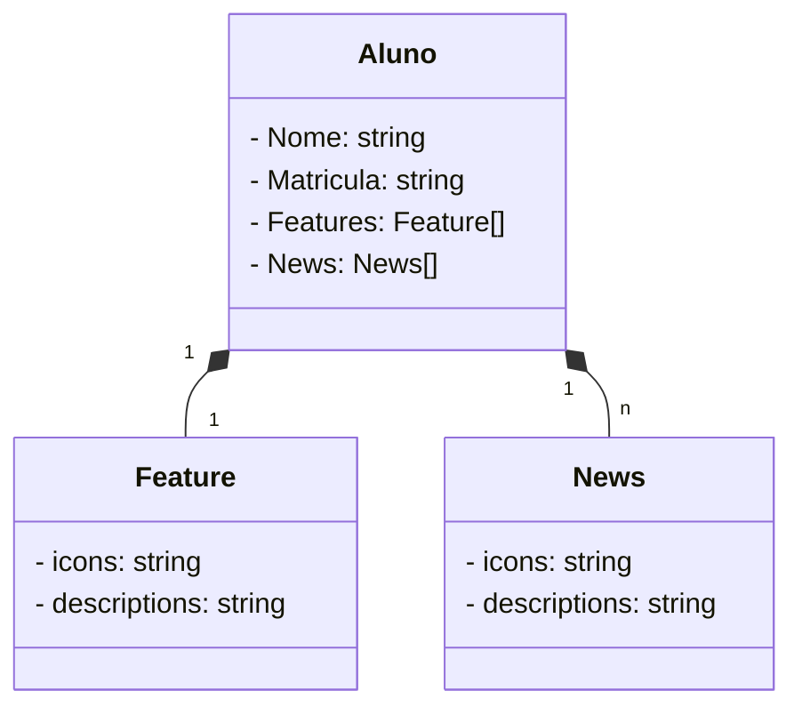

# Santander-Java-DIO
 📌 Projeto Final do Bootcamp Santander Java+Angular 2023
 

## Diagrama de Classes

 

# Linguagens
| Java  
| Javascript  
| Typescript  
| Angular  

# Frameworks 
| Intelligj  
| Elipse  
| Sprong Boot  

# 📝Entregas 
🔸Protoripo Entrega Final | [Figma] (https://www.figma.com/file/qSqLVuNnroa3ntDRBDAk7H/School-Music?type=design&mode=design&t=6ycBDCzkV9S7aoEy-0) 
🔸Caderno de Estudos | [Notion] (https://www.notion.so/debora-dev/Caderno-de-Estudos-52af39a2f5984bf980f1252135c8650f) 
🔸Pokedex | (https://github.com/Lolisdu/js-developer-pokedex)

